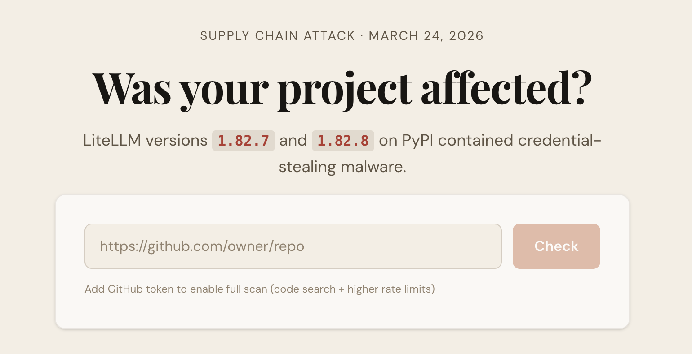

<div align="center">

<h1>
  
  LiteLLM Compromise Checker
</h1>

Check whether a GitHub repository depends on the compromised LiteLLM PyPI releases `1.82.7` or `1.82.8`, with remediation guidance if it does.

**Use the live checker at [litellm-compromised.com](https://litellm-compromised.com/)**

<p>
<a href="https://www.linkedin.com/in/sahar-mor/" target="_blank"></a>
<a href="https://x.com/theaievangelist" target="_blank"></a>
<a href="http://aitidbits.ai/" target="_blank"></a>
</p>

<br/>



</div>

## What It Is

[LiteLLM Compromise Checker](https://litellm-compromised.com/) is a lightweight web app built in response to the March 24, 2026 LiteLLM supply chain attack. Paste any GitHub repository URL and the app scans dependency files plus GitHub code search to estimate whether the repo is currently compromised, at risk, patched, previously used LiteLLM, or shows no trace of it.

## What You Get

- instant checks for public GitHub repositories
- dependency scanning across common Python manifests and lockfiles
- optional GitHub token support for higher rate limits and fuller scans
- attack context, known affected projects, remediation steps, and source links in one place

## Getting Started

1. Install dependencies:

```bash
npm install
```

2. Start the dev server:

```bash
npm run dev
```

3. Open the local URL shown by Vite (typically `http://localhost:5173`) and paste a GitHub repository URL.

## Notes

- The app is fully client-side and talks directly to the GitHub API from the browser.
- If you provide a GitHub token, it is used only client-side for GitHub requests and is not stored by the app.
- A clean result does not guarantee a machine was never exposed; it means the repository does not currently show evidence of compromised LiteLLM usage from the files and code search available to the app.
- Production builds use relative asset paths so the app works on both the custom domain and GitHub Pages.
